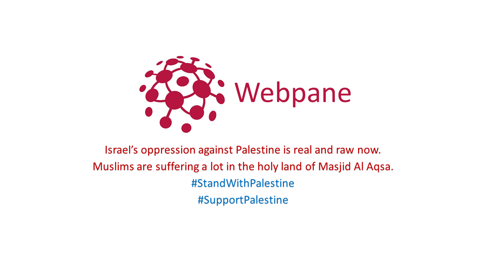

[](https://www.palestinecampaign.org/)


# Integrate SSLCommerz payment gateway to your website


[](https://packagist.org/packages/webpane/sslcommerz)
[](https://github.com/mdnasiruddin733/sslcommerz/fork)
[](https://packagist.org/packages/webpane/sslcommerz)

## Documentation, Installation, and Usage Instructions


## What It Does
This package allows you to make payment, validate payment and refund payment via SSLCommerz gateway.
## Install via Composer

```
composer require webpane/sslcommerz
```
Once installed you have to do the fillowing setup step by step to make it work:

## Publish the config file:
```
php artisan vendor:publish 
```
## Setup your everything related to sslcommerz inside ``` config/sslcommerz.php ``` file. The file looks like as below.

```php

<?php

return [
    "store_id"=>"",
    "store_passwd"=>"",
    "success_url"=>"/success",
    "fail_url"=>"/fail",
    "cancel_url"=>"/cancel",
    "ipn_url"=>"/ipn",
    "currency"=>"BDT",
    "mode"=>"sandbox",
    "product_profile"=>"general",
    "product_category"=>"general",
    "shipping_method"=>"NO",
    "multi_card_name"=>"bkash,qcash,bankasia",
    "from_localhost"=>"true",

];

```

## Open your laravel project and navigate to ```routes/web.php``` and make the following routes for payment.


```php
Route::post("/success",function(Request $req){
   /* 
      implement your code here that will be executed after payment is successfull 
   */
});


Route::post("/fail",function(Request $req){
    /* 
      implement your code here that will be executed after payment is failed 
   */
});

Route::post("/cancel",function(Request $req){
   /* 
      implement your code here that will be executed after payment is cancelled
   */
});
```
<p><strong>Note:</strong>&nbsp;The example of routes and their action show above is using calback url that receives Request from gateway page url. You have the vast flexibility to implement it using controller.</p>


## Navigate to your projects  ``` app/Http/Middleware/VerifyCsrfToken.php ``` file and paste the following code
```php
protected $except = [
        "/success","/fail","/cancel"
];
```

### Make a controller and implement codes more or less below.

```php
<?php

namespace App\Http\Controllers;

use Illuminate\Http\Request;
use Webpane\SSLcommerz\Facades\SSLcommerzFacade as SSLcommerz;

class PaymentController extends Controller
{
   public function index(){
        $post_data = array();
        $post_data['total_amount'] = "200";
        $post_data['currency'] = "BDT";
        $post_data['tran_id'] = uniqid();
        

        # EMI INFO
        $post_data['emi_option'] = "1";
        $post_data['emi_max_inst_option'] = "9";
        $post_data['emi_selected_inst'] = "9";

        # CUSTOMER INFORMATION
        $post_data['cus_name'] = "Test Customer";
        $post_data['cus_email'] = "test@test.com";
        $post_data['cus_add1'] = "Dhaka";
        $post_data['cus_add2'] = "Dhaka";
        $post_data['cus_city'] = "Dhaka";
        $post_data['cus_state'] = "Dhaka";
        $post_data['cus_postcode'] = "1000";
        $post_data['cus_country'] = "Bangladesh";
        $post_data['cus_phone'] = "01711111111";
        $post_data['cus_fax'] = "01711111111";

        # SHIPMENT INFORMATION
        $post_data['ship_name'] = "Store Test";
        $post_data['ship_add1 '] = "Dhaka";
        $post_data['ship_add2'] = "Dhaka";
        $post_data['ship_city'] = "Dhaka";
        $post_data['ship_state'] = "Dhaka";
        $post_data['ship_postcode'] = "1000";
        $post_data['ship_country'] = "Bangladesh";
  

            

        # CART PARAMETERS
        $post_data['cart'] = json_encode(array(
            array("product"=>"DHK TO BRS AC A1","amount"=>"200.00"),
            array("product"=>"DHK TO BRS AC A2","amount"=>"200.00"),
            array("product"=>"DHK TO BRS AC A3","amount"=>"200.00"),
            array("product"=>"DHK TO BRS AC A4","amount"=>"200.00")
        ));
        $post_data['product_amount'] = "100";
        $post_data['product_name'] = "Dummy Prodcut";
        $post_data['product_category'] = "general";
        $post_data['product_profile'] = "general";
        $post_data['vat'] = "4";
        $post_data['discount_amount'] = "0";
        $post_data['convenience_fee'] = "0";
        return SSLcommerz::pay($post_data);
        
}

    public function refund(){
        $data['bank_tran_id']="2204271246030V8uHUUtOGqZtfJ";
        $data['refund_ammount']="3.0";
        $data['refund_remarks']="No reason";
        return SSLcommerz::refund($data);
    }


    public function validatePayment(){
        $data['val_id']="2204271448481ZvTQ9Z5172akQZ";
        return SSLcommerz::validate($data);
    }

}

```

<a href="https://web.facebook.com/webpane" target="_blank" style="text-decoration:none;">
   
   <span style="line-height:100%;margin:10px 4px;line-height:10px;display:inline-block;">
   Get  upadates in our facebook page
   </span>
</a>
